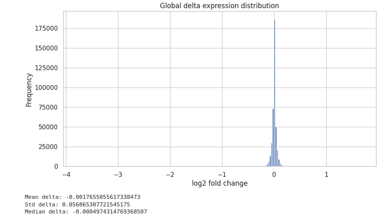
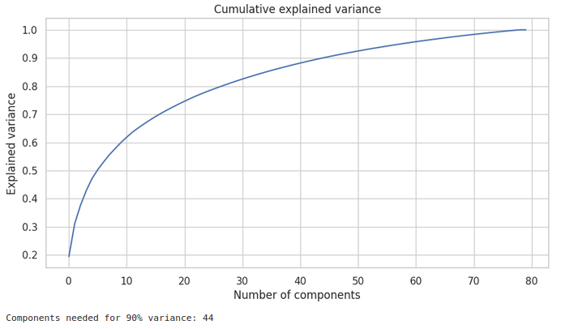

# CRISPRi Perturbation Response

Machine learning pipeline for predicting transcriptomic responses to CRISPR interference (CRISPRi) perturbations using single-cell RNA sequencing data and latent-space modeling.

## Competition

This project was developed for:

**Myllia Biotechnology. *Myllia | Echoes of Silenced Genes: A Cell Challenge*. Kaggle, 2026.**
[Competition page](https://www.kaggle.com/competitions/echoes-of-silenced-genes)

The challenge explores whether computational models can predict how human cancer cells respond to previously unseen gene perturbations, a problem closely related to the development of **virtual cell models**.

---

## Project Overview

CRISPR interference (**CRISPRi**) reduces the expression of a targeted gene without modifying its DNA sequence. Perturbing one gene can consequently alter the expression of other genes through regulatory pathways, signaling networks, metabolic processes, and broader cellular responses.

The objective of the competition was to predict the **change in average gene expression induced by a CRISPRi perturbation**.

For each perturbation, the model had to predict log-scale delta expression values across **5,127 genes**.

The broader biological question is:

> Can the transcriptional consequences of an unseen gene perturbation be inferred from previously observed perturbations and the underlying transcriptional state of the cells?

This type of problem is relevant to perturbation biology, functional genomomics, single-cell transcriptomics, and computational approaches to modeling cellular behavior.

---

## Dataset

The competition provides several complementary data sources:

* **Average expression profiles** for 80 known CRISPRi perturbations and a non-targeting control.
* **Single-cell RNA-seq data** containing raw UMI counts and experimental metadata.
* **Ground-truth scoring information** for the training perturbations.
* **Perturbation mappings** connecting validation IDs with their corresponding targeted genes.

The main prediction target was constructed as:

```text
delta expression = perturbed expression - non-targeting expression
```

The single-cell data were additionally used to characterize the genes targeted by each perturbation.

### Important Data Availability Note

Competition datasets are **not included in this repository**.

Anyone wishing to reproduce the project should obtain the data directly from the [Kaggle competition page](https://www.kaggle.com/competitions/echoes-of-silenced-genes) and accept the corresponding competition rules and data-use conditions.

---

## Exploratory Analysis

The exploratory analysis revealed several important properties of the perturbation-response matrix:

* Only approximately **0.46%** of gene–perturbation pairs showed an absolute delta expression above 0.25.
* Each perturbation affected approximately **24 genes on average** at this threshold.
* Perturbation strength was highly heterogeneous.
* Approximately **44 principal components captured 90% of the variation** across the training perturbations.

These observations suggested that the transcriptional response was both **highly sparse** and structured around a substantially lower-dimensional latent space.

<p align="center">
  
  
</p>

---

## Modeling Approach

Given the limited number of training perturbations and the high dimensionality of the prediction target, the pipeline focused on a lightweight latent-space approach rather than directly predicting all 5,127 genes.

The main workflow was:

```text
Single-cell RNA-seq
        ↓
Gene-level features
        ↓
Perturbed gene representation
        ↓
Small MLP
        ↓
44-dimensional latent response
        ↓
Inverse PCA
        ↓
5,127 predicted gene-expression changes
```

### Feature Engineering

Gene-level features were derived from the single-cell RNA-seq data, including:

* mean expression
* expression variance
* dropout / detection rate
* PCA-based gene embeddings

The PCA loadings provide additional information about how each gene relates to major patterns of transcriptomic variability observed across individual cells.

### Latent Target Representation

Instead of learning the full 5,127-dimensional response directly, PCA was applied to the training perturbation matrix.

The model therefore learned:

```text
gene features → 44 latent transcriptional components
```

Predictions were subsequently reconstructed into the original gene-expression space using the inverse PCA transformation.

### Neural Network

A small multilayer perceptron (**MLP**) was used for the regression task.

Training included:

* AdamW optimization
* Layer Normalization
* GELU activations
* Dropout
* learning-rate scheduling
* gradient clipping
* mixed-precision training on GPU
* cross-validation

Hyperparameters were explored with **Optuna**.

Because the official scoring metric compares predictions against the average training perturbation baseline, final predictions were also blended with this baseline to improve stability.

---

## Repository Structure

```text
crispri-perturbation-response/
│
├── README.md
├── requirements.txt
├── .gitignore
│
├── configs/
│   └── config.yaml
│
├── notebooks/
│   ├── 01_eda.ipynb
│   └── 02_fe_modeling.ipynb
│
├── src/
│   ├── __init__.py
│   ├── data.py
│   ├── features.py
│   ├── metrics.py
│   ├── model.py
│   ├── train.py
│   └── inference.py
│
└── assets/
    ├── delta_distribution.png
    └── pca_explained_variance.png
```

### Notebooks

* **`01_eda.ipynb`** — exploratory and biological analysis of perturbation and single-cell data.
* **`02_fe_modeling.ipynb`** — feature engineering, validation, model training, hyperparameter optimization and submission generation.

The `src/` directory contains modular versions of the main components implemented in the notebooks.

---

## General Workflow

```text
Competition Data
      │
      ├── Average perturbation profiles
      └── Single-cell RNA-seq
              ↓
        Feature Engineering
              ↓
      Latent-space modeling
              ↓
        Cross-validation
              ↓
      Hyperparameter tuning
              ↓
       Final prediction
              ↓
       Kaggle submission
```

---

## Limitations

This project prioritized a **computationally efficient and interpretable workflow** that could be trained using Kaggle resources.

Given the limited experimentation time and computational budget, substantially larger approaches such as pretrained single-cell foundation models, large-scale external-data integration, extensive ensembles, or more computationally demanding perturbation models were outside the scope of this implementation.

The project should therefore be interpreted primarily as an exploration of **single-cell perturbation modeling and biologically informed machine learning**, rather than an attempt to reproduce the most computationally intensive competition solutions.

---

## Organizers

The challenge was organized by **Myllia Biotechnology** and hosted on Kaggle.

Competition information, official rules, datasets, evaluation details, and organizer materials are available through the:

[Myllia | Echoes of Silenced Genes competition page](https://www.kaggle.com/competitions/echoes-of-silenced-genes)

---

## Disclaimer

This repository is an **independent portfolio project** developed based on the Myllia | Echoes of Silenced Genes Kaggle competition.

It is intended exclusively for **educational, research, and portfolio purposes**.

The competition dataset is not redistributed through this repository. All rights associated with the original competition, datasets, competition rules, and applicable data-use or privacy restrictions remain with their respective organizers, data providers, and Kaggle.

Users interested in reproducing the project should consult and comply with the official competition conditions before accessing or using the original data.

